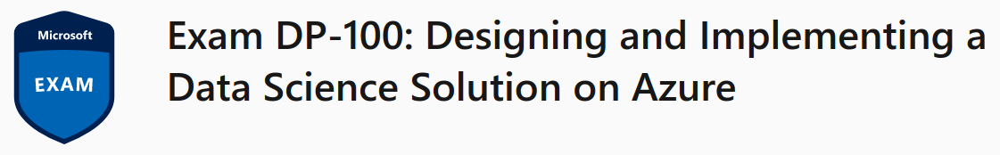
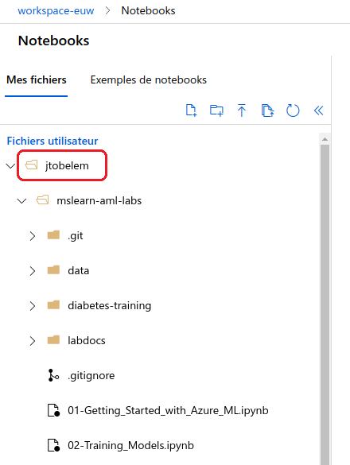
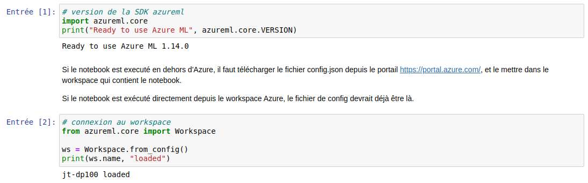
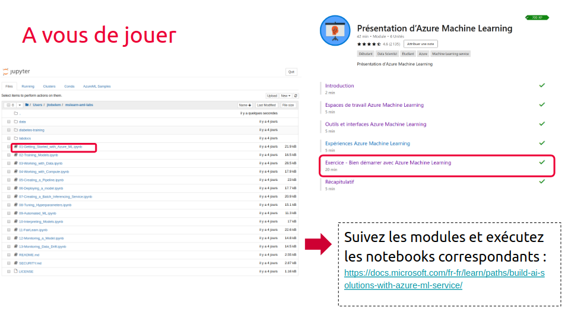

# brief-init-expert

Initialiser un environnement de travail sur votre machine locale pour suivre les cours sur le parcours microsoft :
- [Créer des solutions d’IA avec Azure Machine Learning](https://docs.microsoft.com/fr-fr/learn/paths/build-ai-solutions-with-azure-ml-service/)
- [Créer des modèles Machine Learning](https://docs.microsoft.com/fr-fr/learn/paths/create-machine-learn-models/)

## Livrables

Une capture d'écran comme ci-dessous du studio avec les deux repos installés :
- [mslearn-aml-labs](https://github.com/MicrosoftDocs/mslearn-aml-labs.git)
- [ml-basics](https://github.com/microsoftdocs/ml-basics)


Ainsi qu'une capture d'écran comme ci-dessous avec les lignes suivantes qui fonctionnent :
```python
import azureml.core
print("Ready to use Azure ML", azureml.core.VERSION)

from azureml.core import Workspace

ws = Workspace.from_config()
print(ws.name, "loaded")
``` 



## Référentiels

dp100

## Contexte du projet

Pour initialiser la préparation à la certification dp100 en local, suivez les étapes suivantes :
- vérifiez que conda est installé sur votre machine
- créez un environnement nommé "azure" utilisant python 3.7
- mettez à jour cet environnement avec le fichier fourni environment.yml
- créez un dossier prepa-dp100 et dans ce dossier :
- clonez https://github.com/MicrosoftDocs/mslearn-aml-labs.git
- clonez https://github.com/microsoftdocs/ml-basics
- récupérez le fichier config.json et vérifiez que vous pouvez bien exécuter les lignes suivantes :

```python
import azureml.core
print("Ready to use Azure ML", azureml.core.VERSION)

from azureml.core import Workspace

ws = Workspace.from_config()
print(ws.name, "loaded")
``` 

- suivez maintenant les cours du parcours microsoft et exécutez les notebooks correspondants dans votre environnement configuré



## Modalités pédagogiques

Individuel en autonomie.

## Critère de performance

Avoir complété tous les modules d'apprentissage sur les deux parcours microsoft :
- Créer des solutions d’IA avec Azure Machine Learning : 13 modules
- Créer des modèles Machine Learning : 5 modules

## Modalités d'évaluation

Sur votre poste en montrant à votre formateur votre niveau d'avancement sur les modules d'apprentissage.
